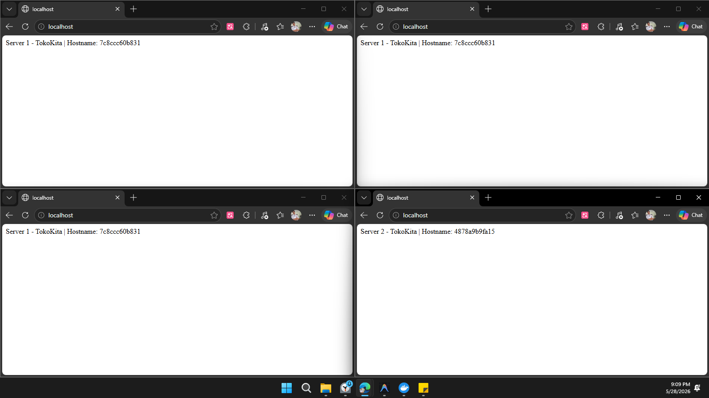
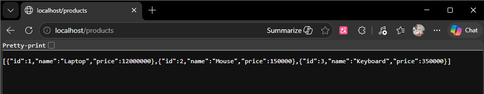
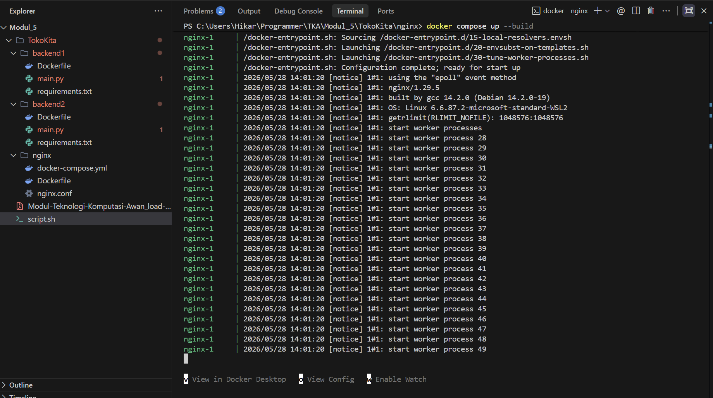

Proyek ini merupakan bagian dari Praktikum Teknologi Komputasi Awan (Modul 5). Dokumentasi ini berisi nama anggota kelompok, panduan lengkap untuk menjalankan sistem, serta bukti *screenshot* keberhasilan implementasi *Load Balancing* menggunakan **NGINX** dengan algoritma **Weighted Round Robin** yang mengarah ke dua server *backend* berbasis **Flask (Python)**.

---

## 👥 Anggota Kelompok & Pembagian Tugas

* **Soal 1:** M. Hikari Reiziq Rakhmadinta (NRP: 5027241079)
* **Soal 2:** Aditya Reza Daffansyah (NRP: 5027241034)
* **Soal 3:** Muhammad Rakha Hananditya Rauf (NRP: 5027241015)

---

## 🚀 Panduan Cara Menjalankan

### Prasyarat
Pastikan perangkat Anda sudah terinstal:
1. Docker Engine / Docker Desktop
2. Docker Compose

### Langkah-langkah Eksekusi
1. Buka terminal atau prompt perintah (Command Prompt, PowerShell, atau Terminal WSL).
2. Pindahkan direktori aktif ke dalam folder `nginx` tempat file `docker-compose.yml` berada:

---

## 📸 Bukti Pengerjaan Soal 1

Berikut adalah tangkapan layar (screenshot) sebagai bukti keberhasilan pengerjaan soal 1:

### 1. Bukti Load Balancer Bekerja

### 2. Pengecekan URL Products

### 3. Tampilan Docker Desktop (Container Running)

